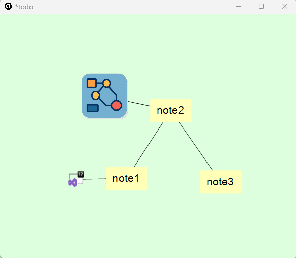

# Infinite Diagram

**Infinite Diagram** is a powerful and flexible tool for creating mind maps and diagrams. It's designed to help you organize your thoughts, take notes, and build complex structures without any spatial limitations.

## ✨ Features

- **Infinite canvas** – Create diagrams without boundaries. Zoom and scale freely.
- **Mind mapping** – Easily create and connect nodes with lines.
- **Sub-diagrams** – Each node can contain its own sub-diagram for deeper structuring.
- **Layers** – Organize your content into multiple layers for better clarity.
- **Attachments** – Add URLs, file links, and images to your nodes.
- **Encrypted files** – Protect your sensitive notes and diagrams with built-in encryption.

## 🧠 Use Cases

- Brainstorming and idea organization  
- Creating structured notes  
- Planning and outlining projects  
- Knowledge mapping  

## 🔐 Security

To protect your data, Infinite Diagram supports encryption of saved files, ensuring your private diagrams remain secure.

## 📎 Attachments

Nodes can contain:
- Web links  
- File paths  
- Images  

## 🖼️ Screenshot

Here’s a sample screenshot of Infinite Diagram in action:

> Replace `screenshot.png` with your actual image file name. Make sure the image is in the same folder as this README.

## 📌 Why "Infinite"?

The diagram space is not limited by a fixed canvas. You can keep expanding, zooming, and structuring your thoughts endlessly.
